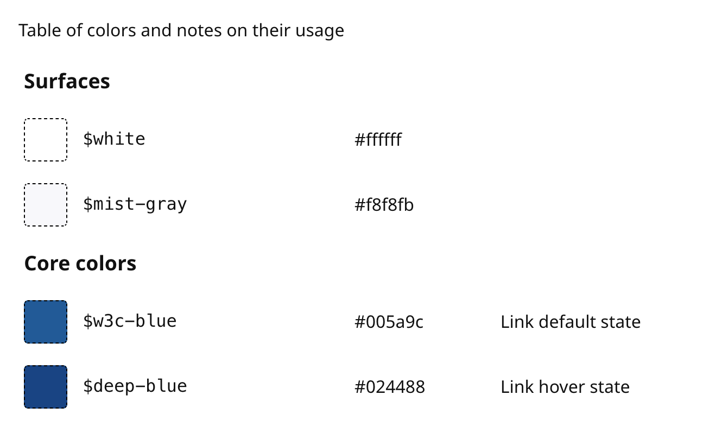

# Color swatches

You can output a set of color swatches to your design system with the `<colors>` custom tag. This looks like: 



## colors tag

To output your color swatch use:

```markdown
<colors src="guidelines/colours.json" />
```

This tag requires one attribute:
* `src` - path to JSON data file for color swatch, relative to your docs folder

## Data structure

You need to define your color swatches in a JSON array. Each array element must contain:

* `title` - the title of your color swatch group
* `colors` - array of color swatches

Each color swatch must contain:

* `color` - The CSS color code (e.g. hex, RGB)
* `variable` - The SASS / CSS variable used to output this color

Each color swatch may optionally contain:

* `alt-variable` - The alternative SASS / CSS variable used to output this color
* `notes` - Any notes to display for this color

### Example data structure

```json
[
  {
    "title": "Surfaces",
    "colors": [
      {
        "color": "#ffffff",
        "variable": "$white"
      },
      {
        "color": "#f8f8fb",
        "variable": "$mist-gray"
      }
    ]
  },
  {
    "title": "Core colors",
    "colors": [
      {
        "color": "#005a9c",
        "variable": "$w3c-blue",
        "alt-variable": "$link-color",
        "notes": "Link default state"
      },
      {
        "color": "#024488",
        "variable": "$deep-blue",
        "alt-variable": "$link-color--hover",
        "notes": "Link hover state"
      }
    ]
  }
]
```